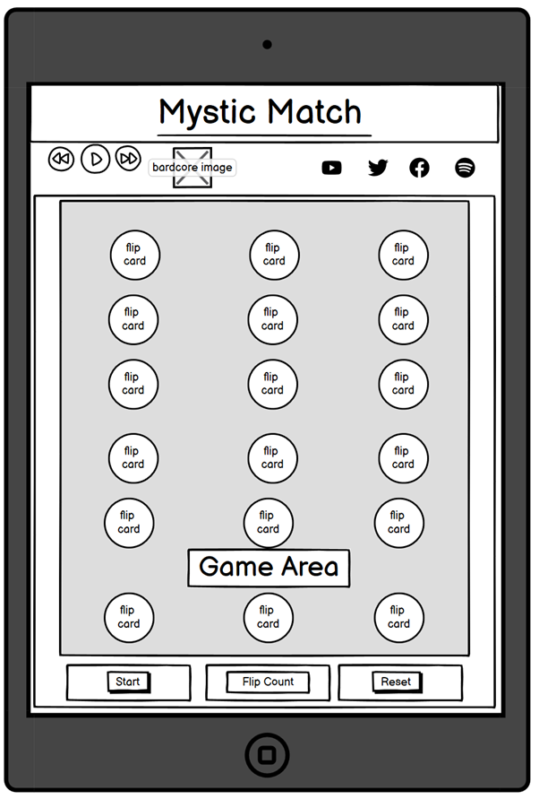

# Mystic Match

Mystic Match is a fantasy inspired card matching game. The purpose of Mystic Match is to match all the pairs of cards as quickly as possible and in as few moves as possible.
Mystic Match was inspired by all things 'cottage-core'. This then evolved into fantasy cottage-core vibes primarily targeted at players who want a 'cosy' matching game, with a love for all things fantasy or folk you would meet during a Live-Action Role-Playing Game. 

## Contents
* [Target Audience](#target-audience)
* [User Experience](#user-experience)
* [Design choices](#design-choices-features-typography-and-wireframes)
    * [Typography](#typography)
    * [Future Implementations](#future-implementations)
* [Features](#features)
    * [Desktop Wire-frames](#wireframes)
    * [Tablet Wire-frames](#wireframes)
    * [Mobile Wire-frames](#wireframes)   
* [Languages, Technologies, Frameworks and Libraries](#languages-used-for-this-project)
    * [Other Technologies Used](#other-technologies-used)
* [Testing](#testing)
    * [Deployment](#deployment)
    * [Clone The Repository](#how-to-clone-the-repository)
    * [How To Create A Fork](#how-to-fork-the-repository)
* [Credits](#credits)
    * [Content](#credits)
    * [Media](#credits)

## Target Audience
the target audience for this project was mainly for anyone and everyone whether users like the idea of mythical creatures or just want a memory game to play, I'd hope that this is what they would be looking for.

## User Experience
as a user, I would like to play a memory game which purely tests your memory based on where images are located in a grid on the page. 

as a user who enjoys fantasy and mythical creatures, I wanted a game that would match that aesthetic. 

as a user, I would like the game to be intuitive and straight forward to learn.

as a user, I want immediate feedback from matched cards such as those that are matched not flipping back.

## Design Choices, Features, Typography and WireFrames

For this project, the design process was fairly straightforward to me, I wanted to show my passion for all things fantasy. Overall the design of this project remains the same across all screen sizes and is fully responsive.

colours for this project are as follows: 

I chose these colours because when I think Fantasy, I think Purples, Mauves, Violets and felt these colours all complemented one another without causing contrast issues. The darkest colour I used for the main background colour, the other three colours mentioned I used as a gradient background for the game area.

### Typography
For this project, the typography used for Mystic Match is Cinzel Decorative, serif font. I wanted something with a little extra flare yet still be readable. 

### Favicon image

### Features
Cards randomize every time the player refreshes the page.
Layout remains fairly similar across all devices due to responsivity.
Mystic Match has overlays which control the 'play-game' functions, 'winner' functions and 'game-over' functions.
this game has a countdown timer and has a matches tracker. 
once the player has matched all cards on the board, they get an automatic winner overlay appear.

### Wireframes

### Future Implementations

- levelling system i.e various levels easy / medium / hard incrementing from a 4 by 4 grid to a 6 by 6 grid for example
- Background Audio and sound effects for example a backing track with user controls and sound effects on card flips and overlays. 
- having images stored in a json document and getting them from that document into the game.

## Testing

Testing for Mystic Match can be found in the adjacent TESTING.md document.

## Languages used for this project

languages used to create Mystic Match are HTML, CSS and vanilla JavaScript.

no other frameworks or libraries where used during the making of this project.

  ### other technologies used 

Gitpod - The IDE used for editing my website code.

Github - Github is used for storage of my website.

gitPages - used to publish my website online.

Favicon generator - used to generate the small logo situated in the tabs bar. 

Balsamiq wireframes - used to draw out the initial skeleton for the game. 

Google Fonts - used to generate a font for typography. 

Google Chrome - for testing and for the use of Devtools to help identify visual bugs on a live preview.

Am I responsive? - used to generate the image at the top of the document showing four different devices all at once. 

Cloudconvert website - used to convert images to PNG instead of JPG images.

Replit AI to help better understand errors and metrics. 
     
## Deployment

Project-Portfolio-2 was deployed to Github pages. 

The steps I took to do this are as follows below: 
     
In the GitHub repository, I clicked on the "Settings" tab.
     
I then navigated to the "Pages" tab on the left-hand sidebar.
     
Under "Source" click the "None" dropdown and selected the "main" or "master" branch.

Clicked "Save".

Once the master branch had been selected and the browser has reloaded itself, the page then provided the link to the live deployed version of the website.

The live link can be found here - Portfolio-Project-2 (https://beebeebethc.github.io/Portfolio-Project-2/).

  ### How to clone the repository

For local development, If you wish to explore the making of Portfolio-Project-2, "Mystic Match", follow these steps below to create a clone:
    
     1. Go to the Repository that you wish to clone Portfolio-Project-2 (https://github.com/BeeBeeBethC/Portfolio-Project-2).
    
     2. Click on the green button with white text that reads 'code'.
    
     3. On the dropdown menu that appears once clicked, select the 'copy URL to clipboard' button (looks like two squares overlaying one another).
    
     4. Open your code editor, (for myself it's Visual Studio Code). On Visual Studio Code, Click the 'Source Control' button from the left hand side of the screen (the one that can also be   used to commit changes).
      - 4a. On alternative code editors,open the terminal and change the working directory to the location of your cloned repository. 
     5. Paste the repository URL into the top navigation bar of Visual Studio Code.
      - 5a. On alternative code editors, type 'git clone' into the terminal and paste the link of the URL
    
     6. Save the Repository to a localised folder where the repository will be stored on your computer.
    
     7. Click on select Repository location. 
    
     8. Let the Repository download and click 'open' when the onscreen prompt appears in the bottom right hand corner of the screen.

  ### How to fork the repository:

How to create a fork of Portfolio-Project-2 Repository

  1. Sign up or login to Github.
    
  2. Go to the repository for Portfolio-Project-2 (https://github.com/BeeBeeBethC/Portfolio-Project-2)
    
  3. Click the fork button on the top right hand side of the screen.

## Credits

  ### Content

   - Youtuber, BroCode's JavaScript playlist helped me to gain a better understanding of JavaScript https://www.youtube.com/watch?v=Ihy0QziLDf0&
     
   - The idea for overlays was adapted to the project from Youtubers Web Dev Simplified and PortEXE as well as guidance from their project for a match card game to see how everything comes together. 
   - Web Dev Simplified: Youtube Channel - https://www.youtube.com/watch?v=28VfzEiJgy4&t=19s 
   - PortEXE: Youtube Channel -  https://www.youtube.com/watch?v=3uuQ3g92oPQ&t=0s
   - W3Schools information on html, css and javascript content to get a better understanding mainly of how javascript works. 

   - Kera Cudmore's Webinar was used as a guide to set up my own README and TESTING README documentation.
   
  ### Media 

   - The default image and character images where all generated using AI technology through the use of Canva Magic Media. 

  ### Acknowledgements

   Firstly, a shoutout personally to a fellow student of mine, George Small for being an awesome friend and cheerleader when times during this project were tough!
   
   My family and friends who continually offer their support. 

   Luke Buchanan, my mentor for his continued support.

   Sherry_5P_Lead for your advice on where to go for last minute debugging assistance and being there during stages of overwhelm and imposter syndrome!

   ### Authors Final Word

   On reflection of the project, This project has been a steep learning curve into the world of JavaScript and honestly, I've really enjoyed it. Despite the frustrations and despite errors occuring and re-occuring (default image I'm looking at you!) I'm happy where this project is at point of submission. I hope you also enjoy it as much as I have enjoyed creating it.

   