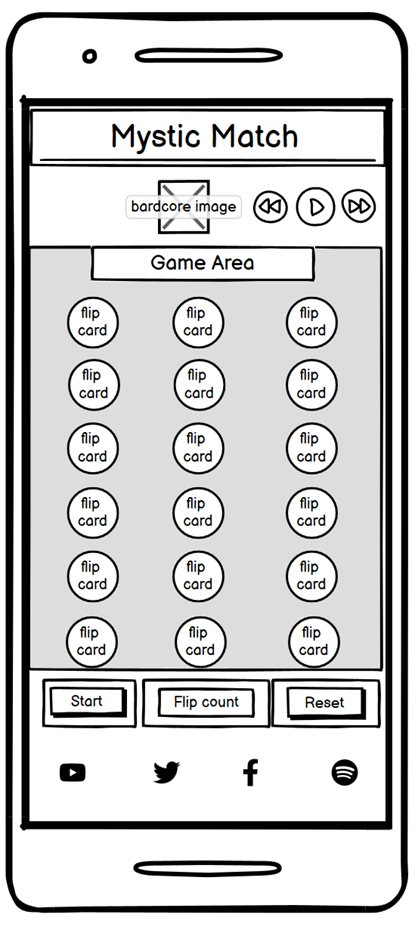

# Mystic Match

Mystic Match is a fantasy inspired card matching game. The purpose of Mystic Match is to match all the pairs of cards as quickly as possible and in as few moves as possible.
Mystic Match was inspired by all things 'cottage-core'. This then evolved into fantasy cottage-core vibes primarily targeted at players who want a 'cosy' matching game, with a love for all things fantasy or folk you would meet during a Live-Action Role-Playing Game. 

TODO add in amiresponsive screenshot of finished webpage.

# Contents

# Design Choices

tested json file using json lint. json has no errors.

## Typography

- Cinzel Decorative, serif font.

## Features and Wireframes
- Music plays automatically. The user has an option of pausing the music on the playback buttons located above the game area. 
- Permission to use the track was granted in writing from Bardcore themselves.
- Social Media Links are included to Bardcore's social media accounts.
- Cards randomize every time the player starts the game or presses the reset button at the bottom. 
- Layout remains fairly similar across all devices.
- Unsure whether or not the game will have a timer option that counts how long it takes for players to match all the cards.

