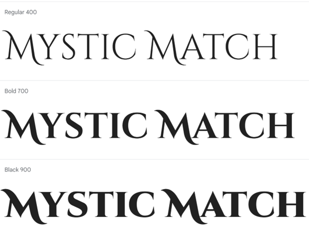
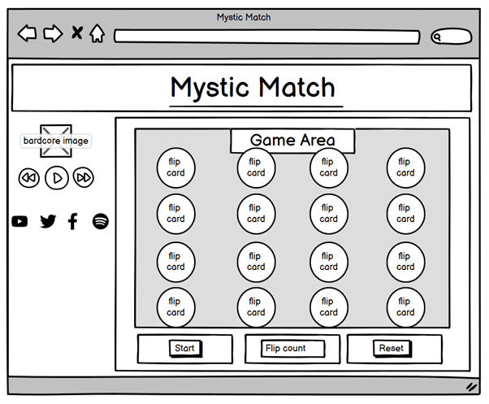
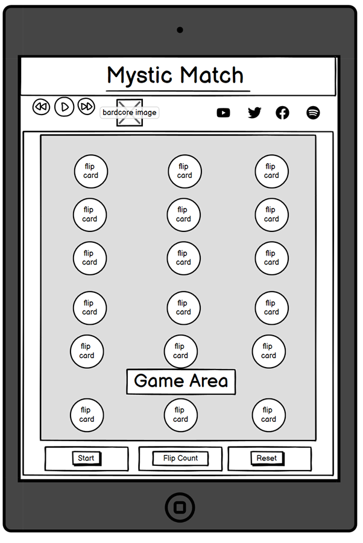
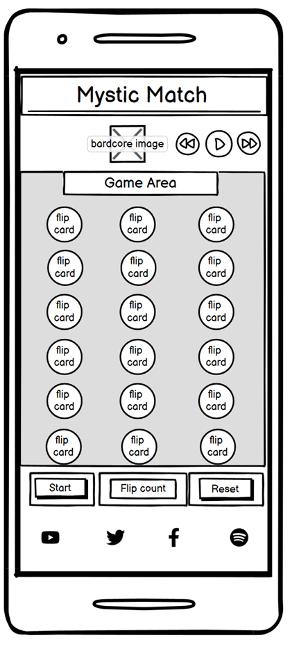

# Mystic Match

Mystic Match is a fantasy inspired card matching game. The purpose of Mystic Match is to match all the pairs of cards as quickly as possible and in as few moves as possible.
Mystic Match was inspired by all things 'cottage-core'. This then evolved into fantasy cottage-core vibes primarily targeted at players who want a 'cosy' matching game, with a love for all things fantasy or folk you would meet during a Live-Action Role-Playing Game. 

TODO add in amiresponsive screenshot of finished webpage.

# Contents

# Design Choices

## Typography

- Cinzel Decorative, serif font.

## Features and Wireframes
- Cards randomize every time the player refreshes the page.
- Layout remains fairly similar across all devices.

