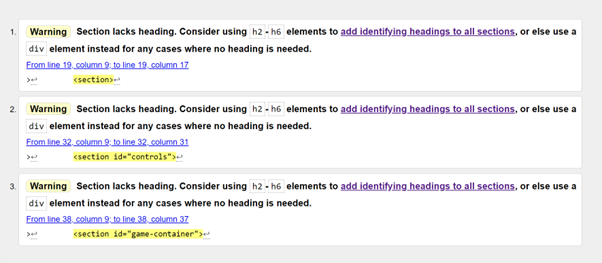
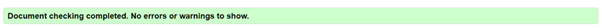
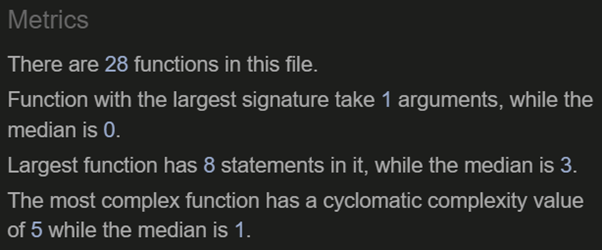
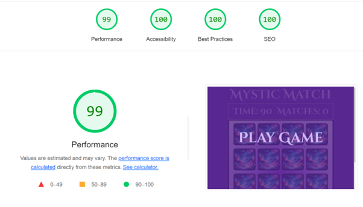
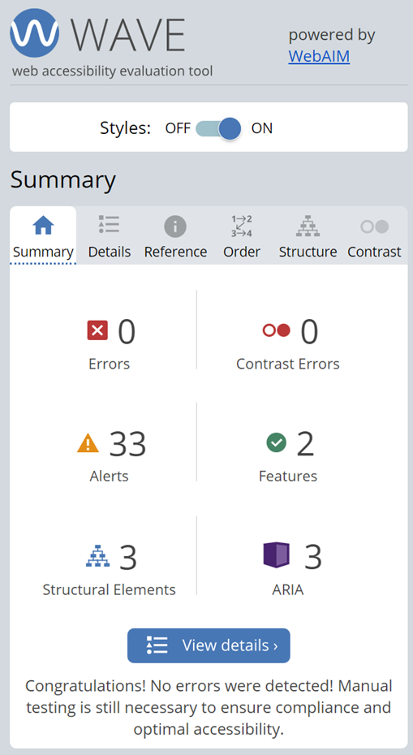

# Mystic Match
Welcome to the testing document for Mystic Match.

## Contents

   * [Full Website Testing](#full-website-testing)
   * [Validator Testing](#validator-testing)
   * [W3S HTML Testing](#html-testing)
   * [W3S CSS Testing](#css-testing)
   * [JSLint Testing](#javascript-testing-using-jslint)
   * [Lighthouse Scoring](#lighthouse-testing)
   * [Debugging](#debugging)
      * [Known bugs](#known-bugs)
      * [Resolved Bugs](#resolved-bugs)
      * [Existing Bugs](#existing-bugs)
   * [Wave Scoring](#wave-testing)
   * [Further Testing](#further-testing)

## Full website testing

| Website Feature   | Expected Outcome | Testing Performed | Result | Pass or Fail |
| ----- | ----- | ----- | ----- | ----- |
| Game Play |
|  |  |  |  |  |
| play game overlay | When clicked the user will start the game and trigger the timer to start counting down | Clicked overlay | game started, timer started changing | Pass |
| clicked a card | When clicked the card will flip | Clicked card | card flipped revealing character image | Pass |
| clicked two matching cards | When clicked two matching cards match count increments by 1 | Clicked matching cards | match count changed by one increment at a time per match | Pass |
| timer function | When timer gets to zero, game over overlay will show. | set the game playing, timer counted to zero | game over, overlay shows. | Pass |
| match count | When match count equals to 8, winner overlay will trigger | Clicked and matched all cards | all cards matched, winner overlay shown | Pass |
| game over overlay | when clicked should reset the entire game | clicked the overlay | the timer and match count reset but the overlay did not refresh card deck | see bug section |
| winner overlay | when clicked should reset the entire game | clicked the overlay | the timer and match count reset but the overlay did not refresh card deck | see bug section |
|   |   |   |   |   |

## Validator Testing
validator testing is as follows: 

### HTML Testing
initially, I had sections in my code to clearly mark different areas. After running through W3Schools HTML validator, warnings came up about the sections with missing headings, therefore on removing these sections and replacing them with the div elements, All tests passed. 

### CSS Testing
my css document didn't have any errors or warnings to show.

### JavaScript Testing using JSLint
 
my JavaScript file returned these metrics:

at first glance, I wondered what all of them meant, I opened Replit and used Replit AI to help better understand the metrics from JSLint.

on reflection, these are my interpretations from the metrics. 

- Total Number of 28 functions
- function signatures:
   - Largest Function Signature: 1 argument
   - Median Function signaturte: 0 arguments
- Function Length: 
   - Largest Function: 8 statements
   - Median Function length: 3 statements
- Cyclomatic Complexity:
   - Most Complex Function: Cyclomatic complexity of 5
   - Median Cyclomatic complexity: 1

Total Functions - there are 28 functions all together written in this file, due to the volume of functions, this means that each function is modularized which in turn allows for better organization and maintainability. 

Function Signatures - the largest signature takes one argument, while most functions take no arguments. Due to low signature rates, this indicates that functions are likely to be self-contained, enhansing reusability and reducing dependencies.

Function Length - the largest function is 8 statements, while the median function length is 3. this suggests that functions are concise and likely adhere to the single responsibility principle, making the code easier to read and maintain. 

Cyclomatic Complexity - the most complex function has a cyclomatic complexity of 5, indicating a low level of complexity. the median complexity is 1 indicating that most functions are straightforward with a single execution path. the low complexity values also mean that the code is likely to be easy to understand, read, maintain and test with a reduced risk of complexity related bugs. 

## Lighthouse Testing

Lighthouse scores for this project where all as expected as I tried to make the game as inclusive as I could optimising it for screen readers where possible.

## Wave Testing 

I wanted to check that the project was still as accessible as possible, the alerts link back to the fact that theres lots of aria labels close to one another which it marks as suspicious. Apart from that there are no other issues.

## Debugging
    
### Known Bugs 
   - Cards would only partially flip and have a delay showing the image.
   - default image would throw a 404 error.

### Resolved Bugs
   - Cards now flip as expected, this bug was due to a couple of lines of code that was in my css styles document. One had a transform animation of 1 second ease. The other conflicting animation was a hover animation. By removing the transform and the hover animation it is flipping cards immediately. 
   - On reviewing filepaths and adjusting accordingly the default image file path no longer throws errors. 

### Existing Bugs 
   - The timer doesn't reset following 'game over' overlay. More time would be needed too debug this particular bug fully. Despite this being an existing bug, it's actually quite a useful bug as it allows users to try to complete all the matches without the time constraint. This wasn't intended hence why I've left it in existing bugs and would need more time to either incorporate this as an extra feature or to fix it completely.
     
   - The winner overlay flips cards back and resets the match counter but doesn't re-shuffle the cards. Whilst this is still an existing bug, On web page refresh cards will re-shuffle again and present users with a fresh deck. More time would be needed to debug this completely.

## Further Testing

Further testing was completed across multiple devices on multiple browsers and no further issues where found other than the ones documented above.

- Mobile Devices
   - Samsung Galaxy A33
   - Iphone

- Laptop 
   - Huawei matebook
   - Alienware laptop

I also tested the game on various browsers with no issues 

- Safari
- Chrome
- Firefox
- Microsoft Edge
